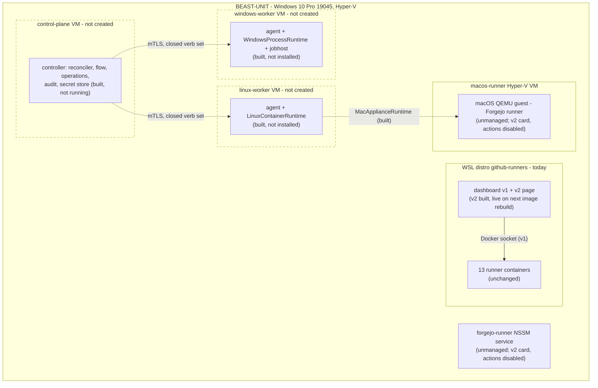

# Uniform runner platform: final report

T-2203. The report `uniform.md` asks for at its end, in its ten items. Written
2026-09-18, when every task whose gate allows unattended work was done and
none of the gated ones had started.

**In one paragraph.** One controller, one RunnerSpec, one lifecycle, one
provisioning flow and one closed control protocol exist. So do runtimes for
Linux containers, Windows process trees and the macOS appliance, provider
adapters for GitHub and Forgejo on all three platforms, and a v2 dashboard
that renders every runner with one card. All of it is tested: 1619 tests in
the dashboard and 336 in the agent, green. None of it is deployed. There is no
Hyper-V worker, the agent runs on no machine, and the 13 runners on WSL run as
they did before. So the platform is built and shown correct against
stand-ins. It has not been shown working on a single real worker, and this
report does not claim it has.

## 1. The current state

Design section 2, measured when the design was written and unchanged by this
work:
- 13 runner containers on one WSL distro (10 GitHub, 3 Forgejo), and a
  Flask dashboard that drives them through the Docker socket;
- a Forgejo runner as an NSSM service on the host itself;
- a Forgejo runner in a QEMU macOS guest inside a Hyper-V Linux VM;
- five creation paths that disagree, and identity by container name;
- nine WSL couplings, recorded as strict xfail tests in
  `dashboard/tests/test_wsl_couplings.py`, all nine still xfail.

## 2. The Hyper-V architecture

Design section 10, unchanged. A control-plane VM holds the controller, the
state store and the dashboard. A Linux worker VM runs containers and also
hosts the macOS appliance. A Windows Server worker VM runs runner process
trees. Each worker has one agent over mutual TLS with a closed verb set.
Provider and runtime adapters are chosen from tables, never by branches. What
the build added to it is recorded in the design itself (section numbers are
the design's):
- keep_data per area (15.1);
- placement by declared capacity (12.4);
- a unit never removed before its forge record (12.5);
- readiness from two observations (18.5);
- an append-only audit with outcome rows (18.4).

## 3. Diagram

What exists now, and what is designed but not built. Solid boxes are running
or built. Dashed ones do not exist yet.

## 4. The matrix

| | GitHub Actions | Forgejo Actions |
| --- | --- | --- |
| **Linux x64** | Adapter and runtime built. Serving today on WSL (v1). Not yet on a Hyper-V worker | As GitHub. Today's 3 Forgejo runners on WSL |
| **Windows x64** | Adapter and runtime built. No worker. Not run | Adapter and runtime built. The artefact is self-built: the running binary reports `dev`, a traceable build recipe is written, and OPEN-4 (keep maintaining it) is open. Not run |
| **macOS x64** | Adapter and runtime built. No instance. Not run | Running today, outside the control plane. Runtime built. Adoption (T-0802) not done. Not run |

The design's feasibility matrix (9.5) and capability table stand. On Windows
and macOS, jobs cannot use containers, and each card says so from its
capabilities.

## 5. Changed files

127 files between `2caa600` (T-0001) and the commit before this report: 115
added and 12 changed. Tests account for 69 of them. This report,
`2026-09-17-uniform-acceptance.md`, `docs/operations/runner-platform.md` and
the README are added in the same commit as this report.

**The agent** (all new): `agent/__init__.py`, `heartbeat.py`, `jobhost.py`,
`link.py`, `naming.py`, `protocol.py`, `server.py`, `tls.py`, `verbs.py`,
`runtimes/__init__.py`, `runtimes/linux_container.py`, `runtimes/localfs.py`,
`runtimes/macos_appliance.py` and `runtimes/windows_process.py`.

**The controller** (all new, `dashboard/control/`): `agent_client.py`,
`audit.py`, `ca.py`, `forges.py`, `inventory.py`, `operations.py`,
`placement.py`, `provision.py`, `receiver.py`, `reconciler.py`, `redact.py`,
`retry.py`, `secrets.py`, `service.py`, `states.py` and `__init__.py`.

**The store and the runtime seam** (all new): in `dashboard/store/`,
`schema.py`, `specs.py`, `fleets.py`, `storage.py` and `__init__.py`; in
`dashboard/runtime/`, `base.py`, `docker_adapter.py` and `__init__.py`.

**The dashboard.**
- New: `api_v2.py`, `cards.py`, `templates/_card.js`, `fleet_v2.html` and
  `runner_v2.html`.
- Changed: `app.py`, `docker_ops.py`, `providers.py`, `github_api.py`,
  `forgejo_api.py`, `history.py`, `runner_detail.py` and `Dockerfile`.

**Images and documents.**
- New: in `images/windows/` and `images/macos/`, `build-forgejo-runner.md`
  and `manifest.json` each; and `uniform.md`.
- Changed: the design and the plan.

**Tests.**
- The agent, 19 files: the contract suite (`contract/`), fakes for Docker,
  Windows and macOS, and tests for each runtime, cache ownership and safety,
  heartbeat telemetry, and the verb set.
- The dashboard, 50 files: one per task, as listed in the acceptance
  record.

## 6. Migration from WSL and the external runners

The procedure is design section 16 and plan phase 16, T-1701 to T-1709. None
of it has run. Every step is NEVER-AUTO, and every step needs the phase 5
worker first.
1. Pre-flight baseline.
2. One GitHub Linux instance on the new worker beside the WSL fleet for a
   day.
3. Grow the new fleet and retire the WSL runners one at a time: drain, wait
   for idle, deregister, remove.
4. The same for Forgejo Linux, deleting records through the API.
5. The Windows NSSM service: stop it, delete its record, and only then
   remove it.
6. Adopt the macOS runner without re-registering it (T-0802).
7. Compare against the baseline.
8. Retire WSL, which lifts the nine xfails.
9. Sweep for orphans, deleting nothing automatically.

Two prerequisites were found while building and are recorded in the plan:
the runner images must adopt the unit layout and entry points (design 15.1),
and drain needs a mechanism (OPEN-7).

## 7. Tests run, and results

On 2026-09-18, on BEAST-UNIT:

| Suite | Result |
| --- | --- |
| `dashboard/tests` | **1619 passed, 9 xfailed** (the WSL couplings), none skipped |
| `agent/tests` | **336 passed**, none skipped |

Among them, these reached something real and not a fake:
- the Windows Job Object cap, against this machine's kernel: a 512 MiB
  allocation two processes down fails under 128 MiB and succeeds under
  2 GiB, and the Store Python is refused;
- the Windows and macOS directory runtimes' cache clearing, on the real NTFS
  disk: the other runner's files are byte-identical afterwards;
- both v2 pages, loaded in headless Edge against a stub;
- mutual TLS, handshakes on localhost with certificates from the control
  plane's own authority;
- the service-SID derivation, checked against `sc.exe showsid`.

Per-criterion evidence: `2026-09-17-uniform-acceptance.md`.

**Not run**, and why (ACC-19):
- Any test against a Hyper-V worker, or on one (HYPERV): ACC-4, ACC-18,
  T-2002, and the conformance suite on real runtimes.
- Any registration or job against the live GitHub org or Forgejo instance
  (FORGE-LIVE): ACC-1 to ACC-3. The live verification of T-0901 and T-1001
  was not run, and neither was the "trivial workflow" of T-0704 and T-0705.
- Anything in the macOS appliance (MACOS-ENV): T-0802 to T-0805's real
  parts. The darwin binary's hash was not measured.
- Windows Server behaviour of NSSM, `sc.exe`, `icacls` and virtual accounts
  (WINDOWS-INFRA), and the ACL cross-read proof (T-0703). The runtime's
  argument lists are exercised against a fake host only.
- A real Docker engine under the Linux runtime: its argument lists are
  exercised against a fake engine only.
- The migration and history preservation (ACC-15), and everything
  NEVER-AUTO.
- The Go builds of the Windows and darwin Forgejo runners: there is no
  toolchain here.

## 8. Platform and licence limits shown

- **macOS on non-Apple hardware is outside Apple's licence** (design 9.3,
  quoting SLA sections 2J, 2B(iii) and 3). The operator accepted it on
  2026-09-17 as risk R-1. QEMU documents no macOS guest, and Microsoft does
  not support KVM inside a Hyper-V guest.
- **Windows containers are not suitable on this host** (design 9.2). Build
  19045 has no matching Windows Server image, and process isolation cannot
  be satisfied. Windows runners therefore run on the OS of a Windows Server
  guest.
- **Forgejo publishes no Windows or darwin runner** (design 9.4). Both are
  self-built. The Windows one running today reports version `dev`, so its
  tag and commit cannot be recovered from it.
- **The Microsoft Store Python's child processes escape every Job Object**
  (measured 2026-09-18). A Windows worker needs a regular Python install,
  and the job host refuses the Store one.
- **Neither runner documents a way to pause itself** (OPEN-7). Drain has no
  mechanism yet, and every runtime declares it unsupported.

## 9. Installation and deployment

`docs/operations/runner-platform.md`. Section 3 covers the one deployment
possible now: rebuilding the dashboard image, and exactly what it changes.
Section 4 lists the manual steps the gated tasks will take for Linux and
Windows workers, the macOS appliance and the forge tokens. It also names
what is still missing before they can be taken.

## 10. Remaining risks and open work

**Open decisions:**
- OPEN-2: the Windows Server licence.
- OPEN-3: one worker or one VM per Windows runner.
- OPEN-4: whether to keep maintaining the self-built Windows Forgejo runner.
- OPEN-5: the control plane's memory reservation.
- OPEN-6: the External vSwitch.
- OPEN-7: the drain mechanism.

**To build before a worker can be used:**
- an entry point that starts the agent on a worker;
- a process that runs the controller: the reconciler loop, `LiveForges` and
  the receiver;
- agent-backed runtime adapters in `RunnerService.RUNTIMES` for Windows and
  macOS;
- the macOS `ApplianceHost`;
- runner images and templates that follow the unit layout and its entry
  points;
- the name of a controller runner's running job, from the forges' job APIs.
  Until then a busy card says it is running a job the forge does not name.

**Gated work:**
- phase 5 (HYPERV);
- T-0701, T-0703 and T-0704;
- T-0802 to T-0804;
- T-1405 and T-1407;
- T-1903;
- phases 16 and 17;
- T-2002 and T-2202.

**Risks (design 21):**
- R-2: host commit exhaustion, now with more VMs.
- R-4: the self-built artefacts drift from upstream, made concrete by the
  `dev` binary.
- R-6: the conformance suite gets written to what the adapters do. It was
  written before the second and third runtimes, and its teeth caught one
  gap.
- R-7: certificate expiry. Its health field (T-1903) is not built.

**One behaviour change the next image rebuild brings to the live
dashboard:** removing a runner or recreating a fleet needs the admin role,
on v1 too (T-1902).
