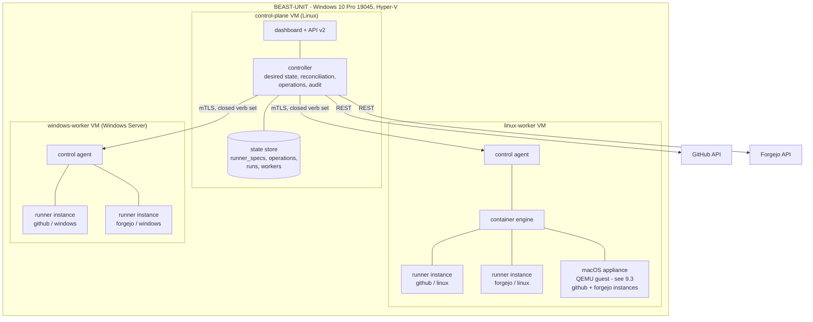
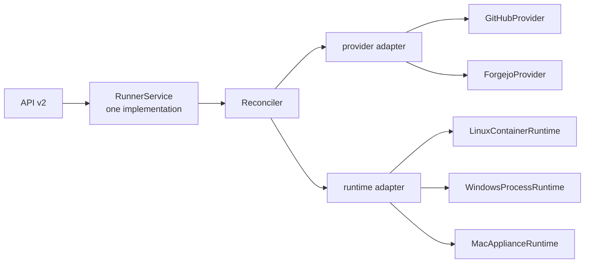
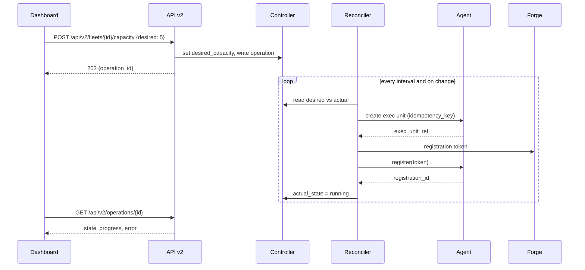
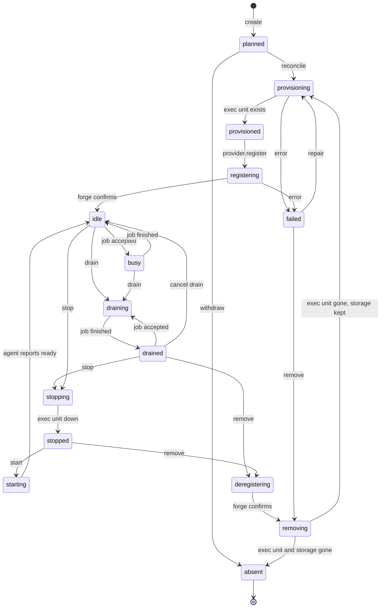
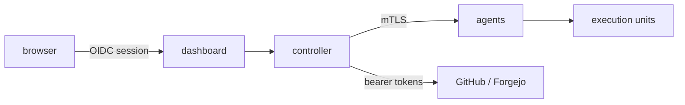

# One uniform Hyper-V runner platform

**Status:** design, not implemented. No production code, infrastructure or
registration has been changed for this document.

**Requirements source:** `uniform.md` (repository root). Every requirement in
that file is numbered here and traced in [Requirement traceability](#8-requirement-traceability).
Nothing in it has been weakened; where something is not achievable, section
[9](#9-feasibility) states the reason, the evidence, the consequence, the
alternatives and the recommendation that stays closest to the original intent.

**Implementation plan:** `docs/superpowers/plans/2026-09-17-uniform-hyperv-runner-platform-implementation.md`

---

## 1. How to read this document

Five kinds of statement appear here and are never mixed:

| Marker | Meaning |
| --- | --- |
| **MEASURED** | Observed on this host or in this repository on 2026-09-17, with the command or file that produced it. |
| **DOCUMENTED** | Stated by primary vendor documentation, with the URL. |
| **ASSUMPTION** | Believed but not verified. Every one carries how to verify it and what breaks if it is wrong. |
| **CHOICE** | An architecture decision, with the alternatives considered. |
| **OPEN** | A decision that needs a human, listed in section [20](#20-open-decisions). |

An unmarked sentence is description, not a claim about the world.

---

## 2. Current state

### 2.1 What runs today

**MEASURED** (`wsl -l -v`, `docker ps`, `docker inspect`, 2026-09-17):

| | |
| --- | --- |
| Host | BEAST-UNIT, Windows 10 Pro build 19045, 2x Xeon E5-2680 v4 presented as 56 logical CPUs, 255.9 GB RAM, no pagefile |
| WSL distros | `docker-desktop` and `github-runners`, sharing **one** WSL2 utility VM and one kernel |
| WSL VM budget | `memory=120GB` in `%USERPROFILE%\.wslconfig`, swap 16 GB |
| Runner engine | Docker 29.6.2 inside the `github-runners` distro, storage driver `overlayfs` (containerd snapshotter), data root `/var/lib/docker` on a 1007 GB ext4 volume |
| Containers | 10 x `github-runner-N`, 3 x `forgejo-runner-N`, 1 x `runner-dashboard` |
| Hyper-V | One VM, `macos-runner`: 8 vCPU, 24 GB **static**, `ExposeVirtualizationExtensions=True`, on the internal `Default Switch` |
| Windows Forgejo runner | The `forgejo-runner` **Windows service** on BEAST-UNIT itself, run by NSSM from `C:\forgejo-runner` |
| macOS Forgejo runner | Container `macos-sequoia` (image `sickcodes/docker-osx`) inside `macos-runner`, QEMU with KVM, 12 GB / 6 cores, macOS Sequoia, runner as a launchd service |
| Windows `Containers` feature | **Disabled** (`Get-WindowsOptionalFeature -Online`) |

### 2.2 The code

**MEASURED** (`wc -l dashboard/*.py`): 4118 lines of Python in 10 modules.

| Module | Lines | Role today | Role after this design |
| --- | ---: | --- | --- |
| `dashboard/app.py` | 1198 | Flask routes, OIDC, settings, websocket | Thin HTTP layer over the controller |
| `dashboard/docker_ops.py` | 1230 | Everything: discovery, telemetry, lifecycle, create/remove, prune | Splits into controller + a Docker **runtime adapter** |
| `dashboard/providers.py` | 168 | The GitHub/Forgejo seam | Stays, widened to three platforms |
| `dashboard/history.py` | 396 | SQLite run history | Gains the RunnerSpec store |
| `dashboard/runner_detail.py` | 314 | Per-runner inspect page | Becomes runtime-agnostic |
| `dashboard/external_telemetry.py` | 91 | Read-only poll of the BEAST-UNIT exporter | Superseded by the control agent |
| `dashboard/github_api.py` | 187 | GitHub REST | Provider adapter |
| `dashboard/forgejo_api.py` | 202 | Forgejo REST | Provider adapter |
| `dashboard/oidc.py` / `users.py` | 162 / 170 | Auth | Unchanged |

Tests: 437 passing (`cd dashboard && python -m pytest tests/ -q`, 2026-09-17).

### 2.3 The five creation paths that disagree

**MEASURED** (read of each file). A runner can be created five ways, and they
do not agree:

1. `docker-compose.runners.yml` - six explicit `github-runner-N` services plus
   `forgejo-runner-1`; sets `stop_grace_period: 60s`, no `nomercy.*` labels.
2. `docker-compose.yml` - a drifted legacy stack: `deploy.replicas`, a
   read-**write** mount of `start.sh`, no `container_name` (so the dashboard
   cannot see what it makes), no `stop_grace_period`.
3. `dashboard/docker_ops.py:create()` - sets both `nomercy.*` labels, mints a
   fresh Forgejo registration token per runner, mounts no `/data` volume.
4. `install/nomercy-github-runners-setup.sh` - name prefix `nomercy-runner-`,
   which `providers.for_name()` does not recognise; never sets
   `REPO_HOST_PATH`.
5. `install/nomercy-github-runners-setup.ps1` - as above, plus the only
   `--tmpfs /tmp` in the repository, which `docker-compose.runners.yml:50-52`
   explicitly argues against.

**MEASURED** consequence: six of ten GitHub runners (3-8, created 2026-08-21)
still carry `--tmpfs /tmp`, an unbounded 59 GB RAM-backed `/tmp`, because they
have never been recreated since the policy changed.

### 2.4 Identity today

**MEASURED**:

- A GitHub runner's identity at the forge is `nomercy-<5 random chars>`
  (`scripts/start.sh:3-4`), unrelated to its container name.
- `docker_ops.list_runners()` selects containers by **name prefix**, because
  compose-created containers carry no label.
- `history.runs.runner` is a TEXT column holding the **container name**.
- The dashboard's API is name-keyed throughout: `/api/runner/<name>/...`.

This is the single largest obstacle to the RunnerSpec model: there is no stable
identity anywhere, and `uniform.md` line 156 forbids using the name as one.

### 2.5 What is WSL-specific

**MEASURED**, exhaustive for the operational path:

| Coupling | Location |
| --- | --- |
| `/mnt/d` repo path | `docker-compose.runners.yml:154`, `docker_ops.py:26` (default) |
| WSL NAT gateway | `.env` `EXTERNAL_EXPORTER_URL=http://172.28.192.1:9101/metrics` |
| Disk measured via `/data` | `docker_ops.py:817-829`, valid only while one VHDX backs everything |
| Windows path in the UI | `templates/index.html:121` renders `D:\Docker\GithubRunners\Data\ext4.vhdx` as a literal |
| Keepalive against idle shutdown | `scripts/keepalive-distro.ps1`, `scripts/install-keepalive-task.ps1` |
| LAN publication | `netsh interface portproxy` `192.168.178.19:9200 -> 172.28.202.20:9200`, rewritten by the keepalive loop because the WSL address changes |
| Clock workaround | `app.py:85-115` `ClockTolerantSessions`, and `provision-distro.ps1:72-73` masking `systemd-timesyncd` |
| DNS workaround | `provision-distro.ps1:55` pins public resolvers after the WSL DNS proxy failed |
| Memory reclaim knob | `provision-distro.ps1:82` `vm.compaction_proactiveness=20` |

**MEASURED** two stale portproxy rules point at `172.19.10.30`, an address the
macOS VM no longer has (it is `172.19.136.46`), so noVNC is already broken
through that path.

### 2.6 Why this is being done

**MEASURED** failure record that motivates `uniform.md`:

- 2026-09-14 21:26 and 2026-09-17 10:53: Windows killed the shared WSL VM for
  commit exhaustion. Because `docker-desktop` and `github-runners` share one
  utility VM, the user's own Docker died with the fleet both times.
- 2026-09-17: a container wedged in `removal already in progress` could not be
  cleared, because `live-restore` was off and a daemon restart would have
  killed seven running builds. (`live-restore` has since been enabled; see
  section [17.1](#171-already-landed).)
- The disk reached 94% of 1007 GB with nothing on the dashboard warning,
  because the nested `fuse-overlayfs` driver reported 1.3 GB where 59 GB sat.

---

## 3. Scope

### 3.1 In scope

The six provider/platform combinations of `uniform.md` lines 13-17, each
created, scaled, started, stopped, restarted, drained, removed, monitored and
maintained from one dashboard; one control plane over multiple Hyper-V workers;
one RunnerSpec; one lifecycle state machine; one control protocol; one storage
and cache model; the migration off WSL; and the retirement of the read-only
"Elsewhere" section.

### 3.2 Non-goals

Stated so they are not silently assumed:

- **No new CI features.** Nothing about what a job does changes. Workflows in
  consuming repositories are out of scope.
- **No multi-host clustering.** One Hyper-V host, BEAST-UNIT. The worker
  inventory is a list, not a scheduler across machines. The protocol is
  designed so a second host can be added later without redesign, but that is
  not built.
- **No autoscaling on queue depth.** `uniform.md` requires scale up and scale
  down as operations and a desired capacity per fleet; it does not require a
  policy engine that sets that number.
- **No replacement of the forges.** GitHub and Forgejo stay as they are.
- **No change to how jobs are isolated from each other inside a runner.** One
  job at a time per runner instance, as today.

### 3.3 Explicitly still required, though it may look like scope creep

- `uniform.md` line 411 requires implementation to continue past the design for
  everything that is safe to build and test locally. This document is therefore
  paired with a task-level plan, and the plan marks per task what can run
  locally and what needs real infrastructure.
- `uniform.md` line 452 rejects a cosmetically uniform dashboard over
  heterogeneous back ends. Section [10](#10-target-architecture) is written
  against that test.

---

## 4. Requirements

Numbered from `uniform.md`. **FR** = functional, **NFR** = non-functional,
**CON** = constraint, **MIG** = migration, **ACC** = acceptance. The line
numbers are into `uniform.md`.

### 4.1 Functional

| ID | Requirement | Source |
| --- | --- | --- |
| FR-1 | All six provider x platform combinations exist and are usable | 13-17, 21 |
| FR-2 | Every combination is created, scaled, started, stopped, restarted, drained, removed, monitored and maintained from one dashboard | 19 |
| FR-3 | One declarative RunnerSpec per runner instance, persisted | 80, 112, 132-154 |
| FR-4 | Stable runner IDs; the name is never the only identity | 156 |
| FR-5 | Desired state plus idempotent reconciliation to actual state | 158, 236 |
| FR-6 | One lifecycle contract: create, provision, register, start, stop, restart, drain, cancel drain, recreate, remove, deregister, scale up, scale down, fetch status, fetch logs, inspect resources, clear cache, repair/reconcile | 162-183 |
| FR-7 | One generic provisioning flow, not reimplemented per provider or platform | 99-128 |
| FR-8 | A central controller with an inventory of Hyper-V workers | 228-236 |
| FR-9 | A secured control agent per worker, one versioned protocol | 231-233 |
| FR-10 | Capability and health reporting, heartbeat and last-seen | 234, 252 |
| FR-11 | Asynchronous, traceable operations with operation IDs | 235, 245-246 |
| FR-12 | One generic runner card and one detail page, showing provider, platform, architecture, worker, runtime, status, active job, CPU, memory, runner storage, cache usage, reachability, last heartbeat, current operation and error state | 262-278 |
| FR-13 | The same per-runner actions everywhere: drain, start, stop, restart, recreate, remove, logs, clear cache | 280-289 |
| FR-14 | Fleet-level: add runner, set desired capacity, scale up, scale down, controlled fleet recreate, clear cache of idle runners | 291-298 |
| FR-15 | Six configurable fleets | 300-307 |
| FR-16 | One generic cache action with platform adapters, deleting only data the runner provably owns | 311-322 |
| FR-17 | Cache clear skips or drains active runners, measures before and after, reports space freed and partial failures, is idempotent, never damages another runner | 324-331 |
| FR-18 | Per-runner isolation: own workspace, cache, registration config, logs, resource limits, lifecycle, health status, predictable cleanup | 207-216 |
| FR-19 | Provider differences confined to an adapter for registration, deregistration, API status, tokens, labels and job information | 42-48 |
| FR-20 | Platform differences confined to platform images, bootstrap code and runtime adapters | 50, 95, 194 |

### 4.2 Non-functional

| ID | Requirement | Source |
| --- | --- | --- |
| NFR-1 | Strong mutual authentication between controller and agent | 242 |
| NFR-2 | Encrypted transport | 243 |
| NFR-3 | Per-operation authorization | 244 |
| NFR-4 | Secret redaction; no secrets in browser responses | 245, 254 |
| NFR-5 | Idempotency keys | 246 |
| NFR-6 | Timeouts and bounded retries | 248-249 |
| NFR-7 | Audit logging | 250 |
| NFR-8 | Safe error handling; a failure leaves no half instance and no orphaned registration | 251, 430 |
| NFR-9 | Version compatibility between controller and agent | 252 |
| NFR-10 | The agent accepts only predefined runner operations; no arbitrary command endpoint | 238 |
| NFR-11 | Existing history is preserved | 431 |
| NFR-12 | Regression tests pass; untested work is reported as untested | 433-435 |

### 4.3 Constraints

| ID | Constraint | Source |
| --- | --- | --- |
| CON-1 | Hyper-V is the common infrastructure layer | 27, 420 |
| CON-2 | No WSL in the production runner architecture: no WSL runner host, no WSL Docker engine, no WSL keepalive task, no WSL paths, no dashboard that only drives a WSL socket | 29-34, 421 |
| CON-3 | GitHub and Forgejo share one infrastructure implementation | 42, 429 |
| CON-4 | Linux, Windows and macOS share one dashboard implementation | 50 |
| CON-5 | A shared worker never means shared writable workspace, registration data or unbounded cache | 205 |
| CON-6 | Windows containers with Hyper-V isolation are to be investigated and used where technically suitable | 218 |
| CON-7 | A VM or QEMU guest is never called a container | 222 |
| CON-8 | No `if platform == windows` in templates, no separate routes for external runners, no "Elsewhere" buttons, no hardcoded runner names, no host-specific exceptions in the UI, no second lifecycle via loose scripts | 185-192 |
| CON-9 | `exporters/runner_exporter.py` is read-only and must not casually gain unauthenticated write actions | 256 |
| CON-10 | No live infrastructure change without explicit permission | 361, 411 |

### 4.4 Migration

| ID | Requirement | Source |
| --- | --- | --- |
| MIG-1 | Migrate the Linux GitHub runners out of WSL | 36, 337 |
| MIG-2 | Migrate the Linux Forgejo containers | 338 |
| MIG-3 | Migrate the native Windows Forgejo service into the managed architecture | 38, 339 |
| MIG-4 | Bring the macOS QEMU environment into the same lifecycle; it stops being a read-only "Elsewhere" runner | 40, 340 |
| MIG-5 | Add Windows and macOS runners for GitHub | 341 |
| MIG-6 | Migrate the dashboard off Docker-socket control | 342 |
| MIG-7 | Preserve registrations, names, labels, caches and history | 343 |
| MIG-8 | After migration: no WSL, no unmanaged native runner services, no "Elsewhere", one controller for all six fleets, old installers removed or marked deprecated | 345-351 |
| MIG-9 | During migration avoid: orphaned registrations, duplicate runners, total capacity loss, history loss, accidental cache deletion, aborting active jobs, unapproved live changes | 353-361 |

### 4.5 Acceptance

| ID | Criterion | Source | How it is measured |
| --- | --- | --- | --- |
| ACC-1 | All six combinations implemented | 417 | One runner of each registers and completes a job |
| ACC-2 | GitHub has working Linux, Windows and macOS runners | 418 | A workflow per platform succeeds on a self-hosted label |
| ACC-3 | Forgejo has working Linux, Windows and macOS runners | 419 | As ACC-2 against the Forgejo instance |
| ACC-4 | Hyper-V is the common infrastructure layer | 420 | Every worker is a Hyper-V VM; `Get-VM` lists them |
| ACC-5 | WSL is not part of the runner architecture | 421 | `wsl -l -v` shows no distro serving runners; no repository path under `/mnt/` in the operational configuration |
| ACC-6 | All runners share one RunnerSpec and state machine | 422 | One table, one enum, no platform branch in the controller |
| ACC-7 | All runners are managed over one control protocol | 423 | One agent API; no second control path |
| ACC-8 | All runners use the same isolated storage structure | 424 | Per-runner workspace, cache and registration volume, asserted by test |
| ACC-9 | All runners are driven by the same API and dashboard components | 425 | One card component, one detail page, one route family |
| ACC-10 | Every fleet scales up and down from the dashboard | 426 | Desired capacity change converges |
| ACC-11 | start/stop/restart/drain/remove/recreate/clear cache work for every runner class | 427 | Per-class integration test |
| ACC-12 | No read-only "Elsewhere" runners remain | 428 | The section and its template are deleted |
| ACC-13 | Provider logic is not mixed with platform or infrastructure logic | 429 | Import graph: provider adapters import no runtime module and vice versa |
| ACC-14 | No half instances or orphaned registrations on failure | 430 | Fault-injection test per provisioning step |
| ACC-15 | Existing history is preserved | 431 | Row count and spot checks before and after migration |
| ACC-16 | No secrets leak | 432 | Redaction test over API responses, logs and audit records |
| ACC-17 | Regression tests pass | 433 | `pytest` green |
| ACC-18 | Platform integration tests run where the infrastructure exists | 434 | Recorded per platform |
| ACC-19 | Tests not run are reported as not run | 435 | Explicit list in the final report |

---

## 5. What is already true and must not regress

**MEASURED** on 2026-09-17, landed before this design and relied on by it:

| Property | Where | Why it matters here |
| --- | --- | --- |
| `live-restore: true` on the runner engine | `/etc/docker/daemon.json`, provisioned by `scripts/install-docker.sh` | The daemon can be restarted without killing builds. Every migration step that touches the engine depends on this. |
| The entrypoints refuse to run outside a container | `scripts/start.sh`, `scripts/start-forgejo.sh`, guarded on `/.dockerenv` | Prevents the host engine's `daemon.json` being overwritten. |
| The nested storage driver is detected, not hard-coded | `scripts/start.sh` | A runner whose data root is a real filesystem uses `overlay2`; one whose data root is the container layer keeps `fuse-overlayfs`. This is the mechanism the new platform images inherit. |
| Per-runner volume for the nested engine | `docker-compose.runners.yml`, `docker_ops.create()` | The first piece of FR-18 that already exists. |
| 16-CPU cpusets, 32 GiB ceilings | applied live | Bound `nproc` and therefore build parallelism. |

---

## 6. Vocabulary

Used precisely throughout, and chosen to satisfy CON-7.

| Term | Meaning |
| --- | --- |
| **Control plane** | The controller process plus its state store. Runs once. |
| **Worker** | A Hyper-V VM that hosts runner instances. Has exactly one control agent. |
| **Runner instance** | One registered runner with its own agent process, workspace, cache and registration. |
| **Execution unit** | The thing a runner instance runs inside: a Linux container, a Windows container, or a macOS appliance. Never called a container generically. |
| **Appliance** | A VM or QEMU guest that presents the same control contract as a container-backed runner. Not a container. |
| **RunnerSpec** | The declarative record of a desired runner instance. |
| **Fleet** | A provider x platform group with a desired capacity. |
| **Runtime adapter** | The code that turns lifecycle verbs into operations on one kind of execution unit. |
| **Provider adapter** | The code that talks to GitHub or Forgejo. |

---

## 7. Design principles

1. **One code path, two seams.** Everything flows through the controller. The
   only permitted branching is a provider adapter and a runtime adapter, both
   selected by data on the RunnerSpec, never by an `if` in a route or template
   (CON-8).
2. **Identity is a UUID.** Names are display data (FR-4).
3. **Desired state is the API.** Operations set desired state and enqueue
   reconciliation; they do not perform imperative work in the request (FR-5).
4. **Every operation is resumable.** Anything that creates state records it
   before doing it, so a crash mid-provision is recoverable rather than a leak
   (NFR-8).
5. **The agent has a closed verb set.** It cannot be asked to run a command
   (NFR-10).
6. **Nothing is called uniform that is not.** Where a platform genuinely cannot
   do something, the contract says so in data (a capability flag), rather than
   the UI pretending (CON-7, `uniform.md` 452).

---

## 8. Requirement traceability

Every requirement, the section that specifies it, and the plan task that
implements it. Task IDs are into the implementation plan.

| ID | Specified in | Implemented by |
| --- | --- | --- |
| FR-1 | 9, 10, 13 | T-60xx, T-70xx, T-80xx, T-90xx |
| FR-2 | 10, 14, 16 | T-1401, T-1402, T-1403 |
| FR-3 | 11.1 | T-0201, T-0202 |
| FR-4 | 11.2 | T-0201, T-1601 |
| FR-5 | 12 | T-0301, T-0302, T-0303 |
| FR-6 | 12.2 | T-0304, T-1301 |
| FR-7 | 12.4 | T-0305 |
| FR-8 | 10.2, 12 | T-0301 |
| FR-9 | 13 | T-0401, T-0402, T-0403 |
| FR-10 | 13.4 | T-0404 |
| FR-11 | 12.3, 13.3 | T-0306, T-0405 |
| FR-12 | 14.1 | T-1401 |
| FR-13 | 14.2 | T-1402 |
| FR-14 | 14.3 | T-1403, T-1501 |
| FR-15 | 14.4 | T-1404 |
| FR-16 | 15 | T-1601, T-1602 |
| FR-17 | 15.2 | T-1603 |
| FR-18 | 15.1 | T-0203, T-0601 |
| FR-19 | 10.4 | T-0901, T-0902, T-0903, T-1001, T-1002, T-1003 |
| FR-20 | 10.3 | T-0501, T-0502 |
| NFR-1 | 13.2 | T-0402 |
| NFR-2 | 13.2 | T-0402 |
| NFR-3 | 13.2 | T-0403 |
| NFR-4 | 18.3 | T-1801 |
| NFR-5 | 12.3 | T-0306 |
| NFR-6 | 17 | T-0307 |
| NFR-7 | 18.4 | T-1802 |
| NFR-8 | 12.5, 17 | T-0308 |
| NFR-9 | 13.5 | T-0406 |
| NFR-10 | 13.1 | T-0401 |
| NFR-11 | 11.4 | T-0204 |
| NFR-12 | 19 | T-2001, T-2002 |
| CON-1 | 10.1 | T-0601, T-0701 |
| CON-2 | 16 | T-1701, T-1702 |
| CON-3 | 10.4 | T-1001 |
| CON-4 | 10.3, 14 | T-1401 |
| CON-5 | 15.1 | T-0203 |
| CON-6 | 9.2 | T-0701 |
| CON-7 | 6 | doc-only, enforced by review |
| CON-8 | 14.5 | T-1405 |
| CON-9 | 13.1 | T-0401 |
| CON-10 | 17.2 | plan gating, every phase |
| MIG-1 | 16.2 | T-1703 |
| MIG-2 | 16.2 | T-1704 |
| MIG-3 | 16.3 | T-1705 |
| MIG-4 | 16.4 | T-1706 |
| MIG-5 | 16.5 | T-0704, T-0705, T-0804, T-0805 |
| MIG-6 | 16.6 | T-1407 |
| MIG-7 | 11.4, 16.7 | T-0204, T-1707 |
| MIG-8 | 16.8 | T-1708 |
| MIG-9 | 16.9 | T-1709 |
| ACC-1..19 | 19.4 | T-2003 |

---

## 9. Feasibility

This section exists because `uniform.md` line 391 demands that an unachievable
requirement be reported with evidence rather than papered over. Two of the six
cells cannot be delivered as literally written. Neither is weakened here; both
are stated, evidenced, and given the closest compliant alternative.

### 9.1 What the vendors actually support

**DOCUMENTED.** GitHub Actions self-hosted runners
(https://docs.github.com/en/actions/reference/runners/self-hosted-runners):

> "Windows 10 64-bit, Windows 11 64-bit, Windows Server 2016 64-bit, Windows
> Server 2019 64-bit, Windows Server 2022 64-bit"
> "macOS 11.0 (Big Sur) or later"
> "x64 - Linux, macOS, Windows."

So GitHub supports the runner **application** on all three platforms. The
runner does not have to be in a container; on Windows and macOS, running it on
the operating system directly is the documented shape.

**DOCUMENTED.** GitHub also restricts everything container-shaped to Linux
(https://docs.github.com/en/actions/tutorials/use-containerized-services/use-docker-service-containers):

> "If your workflows use Docker container actions, job containers, or service
> containers, then you must use a Linux runner"

**Consequence for FR-1:** a Windows or macOS runner in this platform can never
serve a workflow that uses `container:`, service containers or container
actions. That is a property of GitHub Actions, not of this design. It is
recorded as a **capability flag** on the RunnerSpec (section 11.3) so the
dashboard states it rather than the user discovering it from a failed job.

**DOCUMENTED.** Forgejo Actions runner releases
(https://code.forgejo.org/forgejo/runner/releases, v13.1.0 assets):
`forgejo-runner-13.1.0-linux-amd64` and `…-linux-arm64` only. **No `windows`
asset and no `darwin` asset.** The installation docs
(https://forgejo.org/docs/latest/admin/actions/installation/binary/) describe
only `linux-${ARCH}`.

**MEASURED**, and this matters: the repository already works around that for
macOS. `~/macos_runner/` on the `macos-runner` VM contains
`forgejo-runner-darwin-amd64` and `forgejo-runner-darwin-arm64`, and
`bootstrap.sh` documents them as locally cross-compiled from source because
"The Forgejo runner project does NOT publish macOS binaries". The macOS Forgejo
runner that is online today runs such a binary.

### 9.2 Windows

**DOCUMENTED.** Windows containers cannot run on a Linux host. Microsoft's
system requirements
(https://learn.microsoft.com/en-us/virtualization/windowscontainers/deploy-containers/system-requirements)
admit only Windows hosts, and a Windows container shares the host's Windows
kernel
(https://learn.microsoft.com/en-us/virtualization/windowscontainers/about/).

> "The Windows container feature is available on Windows Server 2016 and later,
> Windows 10 Professional and Enterprise Editions (version 1607 and later), and
> Windows 11 Pro and Enterprise."

**CHOICE.** A "Windows worker" is therefore a **Hyper-V VM running Windows**.
It cannot be a container inside the Linux worker. This satisfies CON-1: the
infrastructure layer is still Hyper-V.

**DOCUMENTED**, and decisive for which Windows: the version compatibility
matrix
(https://learn.microsoft.com/en-us/virtualization/windowscontainers/deploy-containers/version-compatibility)
gives, for a **Windows 10** host: Windows Server 2019 and 2016 images under
Hyper-V isolation only; Windows Server 2022 images **not at all**; process
isolation ❌ for every image. And:

> "With the exception of WS2022 + Windows 11, Windows Server containers are
> blocked from starting when the build number between the container host and
> the container image are different."

**MEASURED.** This host is build 19045. No Windows Server base image exists at
19045, so process isolation is unsatisfiable here even setting the matrix
aside.

**DOCUMENTED.** Base image lifecycle
(https://learn.microsoft.com/en-us/virtualization/windowscontainers/deploy-containers/base-image-lifecycle):
Windows Server 2019 / build 17763 left mainstream support on 2024-01-09.

**CHOICE, and it is the important one:** the Windows worker guest is **Windows
Server 2019 or 2022, not Windows 10**, and **the runner runs directly on that
guest OS, not inside a Windows container**, unless a concrete workflow ever
needs Windows containers. Reasons, in order:

1. GitHub documents the runner on Windows Server; it does not document the
   runner inside a Windows container (**GAP**, neither endorsed nor forbidden).
2. Windows containers on this host would mean Hyper-V isolation, which is a
   utility VM per container
   (https://learn.microsoft.com/en-us/virtualization/windowscontainers/manage-containers/hyperv-container),
   nested inside a VM. Microsoft supports that nesting
   (https://learn.microsoft.com/en-us/windows-server/virtualization/hyper-v/nested-virtualization:
   "Running Hyper-V isolated containers nested on Hyper-V is supported") but
   documents the cost: "performance overhead … in terms of container start-up
   time, storage, network, and CPU operations".
3. It would pin the platform to an image family already out of mainstream
   support.
4. No workflow in this fleet uses Windows containers today.

**This does not weaken CON-6.** CON-6 asks that Windows containers with Hyper-V
isolation be *investigated and used where technically suitable*. They were
investigated; on this host they are not suitable, for the four reasons above.
The isolation requirement of FR-18 is met instead by **one Windows worker VM
per runner instance** where isolation matters, or by per-runner directories,
ACLs and Job Objects within a shared worker where it does not — see section
[10.5](#105-isolation-strategy-per-platform) for the decision rule and
section [20](#20-open-decisions) OPEN-3 for the sizing choice that remains.

**Consequence for the Forgejo x Windows cell:** there is no Forgejo runner
binary for Windows. Delivering that cell means cross-compiling
`GOOS=windows` from https://code.forgejo.org/forgejo/runner and maintaining
that build, with the `host` executor
(https://forgejo.org/docs/latest/admin/actions/configuration/: labels are
`<name>:<type>://<image>` with types `docker`, `lxc`, `host`) which assumes a
POSIX shell. Upstream neither builds nor tests this.

- **Reason:** no released binary; the `host` executor forks a shell.
- **Evidence:** the release asset list above; the label documentation.
- **Consequence:** the cell is deliverable only as a self-maintained fork-build,
  with no upstream support and a standing maintenance cost at every runner
  release.
- **Alternatives:** (a) build and maintain it, mirroring what already happens
  for macOS; (b) leave the cell empty and document it; (c) run Forgejo Windows
  jobs on a Linux runner with cross-compilation, which changes what the jobs
  can do.
- **Recommendation: (a)**, because the repository already does exactly this for
  `forgejo-runner-darwin-*`, so the capability and the precedent exist. It is
  recorded as a first-class risk (R-4) and the RunnerSpec carries
  `runtime_template` pointing at the self-built artefact so its provenance is
  explicit rather than implied.

### 9.3 macOS: the requirement cannot be met as written, and uniform.md anticipated it

This is the finding `uniform.md` line 391 asks for. It is stated plainly.

**DOCUMENTED.** Apple Inc. Software License Agreement for macOS Sequoia,
https://www.apple.com/legal/sla/docs/macOSSequoia.pdf, revision EA1885 dated
07/11/2024. The title block reads "For use on Apple-branded Systems".

Section 2J, verbatim:

> **J. Other Use Restrictions.** The grants set forth in this License do not
> permit you to, and you agree not to, install, use or run the Apple Software
> on any non-Apple-branded computer, or to enable others to do so.

Section 2B(iii), the only virtualization grant, verbatim:

> (iii) to install, use and run up to two (2) additional copies or instances of
> the Apple Software ... **within virtual operating system environments on each
> Apple-branded computer you own or control that is already running the Apple
> Software**, for purposes of: (a) software development; (b) testing during
> software development; (c) using macOS Server; or (d) personal,
> non-commercial use.

Section 3 addresses continuous integration by name, and does not relax the
hardware condition:

> **Permitted Developer Services means continuous integration services**,
> including but not limited to software development, building software from
> source, automated testing during software development, and running necessary
> developer tools to support such activities.

but only under a lease where

> during the lease period, the End User Lessee must have sole and exclusive use
> and control of the Apple Software **and the Apple-branded hardware on which
> it is installed**

**MEASURED.** The hardware is a 2x Xeon E5-2680 v4 server. It is not
Apple-branded. The macOS guest therefore runs outside every grant Apple makes.

**Reason:** the licence conditions every macOS virtualization right on the host
being an Apple-branded computer that is itself running macOS. The current stack
has no Apple hardware anywhere in it.

**Evidence:** sections 2J, 2B(iii) and 3A(iii) quoted above, from Apple's own
published agreement. The same clauses are materially identical in the macOS 27
agreement (https://www.apple.com/legal/sla/docs/macOS27.pdf, revision EA2005,
07/11/2026), which additionally narrows the exception to a "written, signed"
Apple agreement.

**Two further unsupported layers**, independent of Apple:

- **DOCUMENTED.** QEMU documents no macOS guest. Its target list
  (https://www.qemu.org/docs/master/system/targets.html) has no macOS page, and
  the manual documents no Apple SMC option. Everything that makes the current
  guest boot lives outside QEMU's supported surface.
- **DOCUMENTED.** Microsoft, on nested virtualization
  (https://learn.microsoft.com/en-us/windows-server/virtualization/hyper-v/nested-virtualization):
  > "Virtualization applications other than Hyper-V aren't supported in Hyper-V
  > virtual machines, and are likely to fail."
  > "Non-Microsoft virtualization on Hyper-V virtualization isn't supported."

  KVM inside a Hyper-V guest is exactly that. **MEASURED**: the host does run
  it (`ExposeVirtualizationExtensions=True`, `/dev/kvm` present in the guest),
  so it works; it is simply not supported by the hypervisor vendor either.

**Consequence.** The literal reading of `uniform.md` line 27 plus lines 17 and
69-72 - macOS runner appliances under Hyper-V - would require the platform to
keep running macOS on non-Apple hardware. Building that into a designed,
documented, dashboard-driven platform would take a pre-existing informal
arrangement and make it a deliberate, operationalised licence breach. It would
also rest on two vendor-unsupported layers, which is a reliability argument on
top of the legal one.

**Alternatives**, with what each means for this fleet:

| | What it is | Licence basis | Concurrency | Cost shape |
| --- | --- | --- | --- | --- |
| A | Apple silicon Mac mini on-site, runner as a launchd service on the host | 2A / 2B(i) | 1 runner context per Mac, no per-job reset | One-off hardware |
| B | Apple silicon Mac mini on-site, host macOS plus up to 2 macOS guests via Virtualization.framework | 2B(iii) | 2 isolated, resettable runners per Mac | One-off hardware |
| C | AWS EC2 Mac, bare metal on a Dedicated Host | SLA section 3; AWS states the 24-hour minimum is "to comply with the Apple macOS Software License Agreement" | 1 instance per host, plus up to 2 VMs on Apple silicon | Per-second with a 24-hour floor |
| D | MacStadium, bare metal or Orka | SLA section 3 plus 2B(iii); they document "Apple's software license agreement limits each host to two concurrent macOS VMs" | ceil(peak concurrent jobs / 2) hosts | Subscription |

**Decision taken, 2026-09-17: the existing QEMU appliance on Hyper-V is the
destination, not a transition.**

The operator, who owns the hardware and the licence relationship with Apple,
was shown the finding above in full and decided to continue on the existing
arrangement. That decision is recorded here rather than argued with, and the
evidence stays in place so that whoever reads this later sees both the finding
and the choice. It is tracked as an accepted risk (R-1), not as an open
question.

What follows from it, and it simplifies the architecture:

- **CON-1 is fully satisfied.** Hyper-V is the only infrastructure layer.
  There is no Apple host and therefore no second worker kind, no second
  control path and no split in the worker inventory.
- **The macOS appliance is the `macos-sequoia` QEMU guest** inside the
  `macos-runner` Hyper-V VM, brought under the control agent so it carries a
  RunnerSpec, the lifecycle verbs, telemetry and the same dashboard card as
  every other runner (MIG-4, ACC-12).
- **Both macOS cells are delivered on it**: a second runner instance is added
  for GitHub alongside the existing Forgejo one.
- **OPEN-1 is closed.** Apple hardware is not being bought.

The alternatives in the table above are kept for reference, because the
decision may be revisited if Apple, Microsoft or the workload changes.

### 9.3.1 What the design must do about the unsupported layers

Deciding to keep the arrangement does not make it reliable, and two of the
three unsupported layers have already produced outages recorded in this
repository. The design carries specific mitigations rather than hoping:

| Known failure | Mitigation in this design |
| --- | --- |
| The OpenCore restart loop: the container dies on a leftover `/var/tmp/opencore-image-ng.sh-*` after any hard stop | The appliance runtime's `start` verb clears that path before boot, making the recovery automatic instead of manual |
| VM root disk exhaustion while the container stays Up and QEMU idles, which reads as "runner offline" | Health is the two-part check of 18.5, and appliance telemetry reports the VM's disk, so the real cause is on the card |
| QEMU/KVM inside Hyper-V is unsupported by Microsoft, so a host or hypervisor update can break it without warning | The appliance is the only runner class whose `runtime_template` pins a hypervisor-level dependency; it is listed in the version-deprecation runbook alongside the runner version |
| No upstream release feed for the self-built `forgejo-runner-darwin-*` | Provenance recorded on the spec; same runbook |

These are the reasons the appliance contract in 10.6 exists as a contract
rather than as a special case: the controller treats it identically, while the
runtime adapter absorbs everything that is peculiar to it.

### 9.4 What this means for the four Windows and macOS cells

| Cell | Status | Why |
| --- | --- | --- |
| GitHub x Windows | **Deliverable as documented** | GitHub supports the runner on Windows Server x64 |
| Forgejo x Windows | **Deliverable only as a self-built artefact** | No `windows` release asset; see 9.2 |
| GitHub x macOS | **Deliverable on the existing appliance** | GitHub supports macOS 11+ x64/arm64; a second instance is added beside the Forgejo one |
| Forgejo x macOS | **Running today, to be brought under the lifecycle** | No `darwin` release asset; the repository already builds its own |

**DOCUMENTED**, on the Forgejo artefacts: release v13.1.0 publishes twelve
assets, all `linux-amd64` or `linux-arm64`
(https://code.forgejo.org/forgejo/runner/releases). The project's `Makefile`
carries a `DARWIN_ARCHS` variable that no release target consumes - dead
configuration inherited upstream, not evidence of a build. The maintainers'
stated position is that official support for proprietary operating systems is
out of scope for the project.

**MEASURED**: `~/macos_runner/` on the `macos-runner` VM already contains
`forgejo-runner-darwin-amd64` and `forgejo-runner-darwin-arm64`, and
`bootstrap.sh` documents them as locally cross-compiled for exactly this
reason. The precedent exists; this design makes it explicit rather than
incidental, by recording the artefact in `RunnerSpec.runtime_template` and
its provenance in the runner image manifest.

### 9.5 Feasibility matrix

The matrix `uniform.md` line 444 asks for. "Supported" means the vendor
documents it; "self-built" means it works but no vendor publishes or supports
the artefact.

| | GitHub Actions | Forgejo Actions |
| --- | --- | --- |
| **Linux x64** | Supported. Runner in a container on a Hyper-V Linux worker. | Supported. Same worker, same runtime adapter. |
| **Windows x64** | Supported. Runner on the OS of a Hyper-V Windows Server worker. Not in a Windows container - see 9.2. | Self-built. No `windows` release asset; requires a maintained `GOOS=windows` build and the `host` executor. |
| **macOS x64** | Supported by GitHub. Runs in the QEMU appliance inside the Hyper-V Linux VM. | Self-built `darwin` artefact, same appliance. |

Capability differences that the RunnerSpec carries as data rather than the UI
hiding:

| Capability | Linux | Windows | macOS |
| --- | --- | --- | --- |
| Job-level `container:`, service containers, container actions | yes | **no** (GitHub: Linux only) | **no** |
| Nested container builds inside the runner | yes | no | no |
| Per-job clean workspace by recreate | yes | yes | yes |
| Per-job clean OS by appliance reset | no | no | yes (option B) |
| Runner artefact published by the vendor | both | GitHub only | GitHub only |
---

## 10. Target architecture

### 10.1 The shape



Three things to read out of it:

- **One controller, many workers.** The controller never speaks to a container
  engine, a Windows service or a launchd job. It speaks to agents (FR-8, FR-9).
  This is what replaces "a dashboard that only drives one Docker socket"
  (CON-2, `uniform.md` 34, 226).
- **The macOS appliance is an execution unit on the Linux worker**, not a
  separate host. It is reached through that worker's agent, and it is not a
  container (CON-7); section 10.6 is the contract that makes it uniform.
- **The forges are reached from the controller, never from a worker.** Tokens
  stay in one process (NFR-4).

### 10.2 Why the control plane is its own VM

**CHOICE.** The controller could live on the Linux worker. It gets its own VM
because:

1. **MEASURED** failure mode: on 2026-09-14 and 2026-09-17 the host that ran
   both the fleet and the dashboard died, taking the operator's view of the
   fleet with it exactly when it was needed. A control plane that shares a
   failure domain with the thing it controls cannot report on that failure.
2. Restarting a worker's engine to clear a wedged container must not restart
   the dashboard.
3. It gives the state store its own disk, so a runner filling a volume cannot
   corrupt the history (NFR-11).

Cost: one more VM and its memory reservation. Accepted.

### 10.3 The two seams, and nothing else



`RunnerService` has one implementation for all six cells. The adapter pair is
chosen from `RunnerSpec.provider` and `RunnerSpec.platform`, by table lookup,
never by a conditional at a call site (FR-19, FR-20, CON-3, CON-4, CON-8).

The import rule is testable and is tested (T-0001, T-0003): a provider adapter
imports no runtime module, a runtime adapter imports no provider module, and
neither imports `app`.

### 10.4 What each adapter owns

**Provider adapter** - exactly the six things `uniform.md` line 42-48 allows:
registration, deregistration, API status, tokens, labels, job information. It
receives a `RunnerSpec` and returns plans and facts. It never touches an
execution unit and never learns what a container is.

**Runtime adapter** - the lifecycle verbs against one kind of execution unit.
It receives a `RunnerSpec` and an `ExecUnitRef`. It never learns which forge
the runner belongs to. It reports `capabilities()` so the controller can refuse
an impossible spec early rather than half-creating one.

| Verb | Linux container | Windows process | macOS appliance |
| --- | --- | --- | --- |
| create | `docker run` with per-runner volumes | create the runner directory, service and Job Object | clone the appliance template, boot it |
| start / stop / restart | container lifecycle | service control | appliance power / agent restart |
| remove | container plus its named volumes | service removal plus directory | appliance delete or revert to snapshot |
| status / telemetry | cgroup counters | Job Object and performance counters | agent-reported guest metrics |
| logs | engine logs | runner diag files | runner diag files |
| clear_cache | nested engine prune plus workspace | workspace, toolcache, temp | workspace, toolcache, derived data |

### 10.5 Isolation strategy per platform

`uniform.md` line 200 asks for one consistent strategy, and line 203 allows a
per-instance appliance where container isolation is technically insufficient.
The strategy is one sentence: **one execution unit per runner instance, with
its own writable storage, chosen per platform by what the platform actually
supports.**

| Platform | Execution unit | Why | Isolation guarantee |
| --- | --- | --- | --- |
| Linux | One container per instance on a shared Linux worker | Native, cheap, already proven here | Own container, own `/var/lib/docker` volume, own workspace volume, own cache volume, cgroup CPU and memory limits |
| Windows | One runner **process tree** per instance on a Windows Server worker, under its own local account, own directory tree with ACLs, own Job Object for CPU and memory | Windows containers on this host reach only out-of-mainstream images under Hyper-V isolation, and GitHub does not document the runner in a Windows container (9.2) | Own account, own ACL-scoped directories, own Job Object caps, own service |
| macOS | One macOS guest per instance, as a QEMU appliance on the Linux worker | A macOS runner cannot be a container, and calling a guest a container is forbidden (CON-7) | Whole-OS isolation, resettable to a snapshot between jobs |

**This satisfies CON-5** - a shared worker never means a shared writable
workspace, shared registration data or unbounded cache - on all three, by
different mechanisms, which is exactly what `uniform.md` line 76 permits.

**OPEN-3**: whether the Windows worker should instead be one VM per runner
instance. That is stronger isolation at roughly 4 GB and one Windows licence
per runner. The design supports both: `RunnerSpec.host_id` points at a worker,
and nothing prevents a worker from hosting exactly one instance.

### 10.6 The macOS appliance contract

Because the appliance is not a container, the contract is written explicitly so
that "uniform" is a fact about behaviour rather than a claim in the UI (CON-7).

An appliance is any execution unit that:

1. runs one control agent that speaks the protocol of section 13;
2. answers `status`, `telemetry`, `logs` and the closed `Probe` set;
3. accepts `create`, `start`, `stop`, `remove` and `clear_cache` with the same
   semantics and the same idempotency rules;
4. reports `capabilities()` honestly, including what it cannot do;
5. has a `runtime_template` that identifies its base image or snapshot.

Anything meeting those five points is a runner instance to the controller,
whatever it is underneath. That is the whole of the uniformity claim, and it is
testable: the conformance suite in section 19.2 runs the same scenarios against
all three runtimes.

---

## 11. Data model

### 11.1 RunnerSpec

Every field `uniform.md` lines 134-154 asks for, plus five the design needs.
Stored in the control plane's SQLite database, one row per runner instance.

| Column | Type | Notes |
| --- | --- | --- |
| `runner_id` | TEXT PK | UUIDv4. The only identity. Never derived from a name (FR-4) |
| `display_name` | TEXT | Shown in the UI. Not unique, not an identifier |
| `provider` | TEXT | `github` or `forgejo` |
| `platform` | TEXT | `linux`, `windows`, `macos` |
| `architecture` | TEXT | `x64` or `arm64` |
| `runtime_template` | TEXT | Image reference, appliance snapshot id, or self-built artefact reference |
| `host_id` | TEXT FK | The worker it is placed on |
| `labels` | TEXT | JSON array |
| `runner_group` | TEXT | GitHub runner group; empty for Forgejo |
| `cpu_limit` | TEXT | Adapter-interpreted: cpuset width, Job Object cap, vCPU count |
| `memory_limit` | INTEGER | Bytes |
| `disk_limit` | INTEGER | Bytes |
| `cache_policy` | TEXT | JSON, see 15.2 |
| `desired_state` | TEXT | `running`, `stopped`, `drained`, `absent` |
| `actual_state` | TEXT | The state machine of 12.2 |
| `registration_id` | TEXT | The forge's numeric id, as a string |
| `registration_uuid` | TEXT | Forgejo uuid; NULL for GitHub |
| `created_at` | TEXT | ISO 8601 UTC |
| `last_seen_at` | TEXT | Last agent heartbeat (FR-10) |
| `current_operation` | TEXT FK | The in-flight operation id, or NULL |
| `last_error` | TEXT | Redacted message and a timestamp |
| `capabilities` | TEXT | JSON, from the runtime adapter; see 9.5 |
| `exec_unit_ref` | TEXT | Adapter-private handle, opaque to the controller |
| `fleet_id` | TEXT FK | The fleet this instance satisfies |
| `spec_version` | INTEGER | Bumped on every accepted change, for optimistic concurrency |
| `unit_state` | TEXT | What the worker last reported about the execution unit: `running`, `stopped`, `absent` or `unknown`. Written by heartbeats and outside `spec_version`, because an observation every 10 s must not make every human change a stale-version conflict. Added in T-0404 |
| `telemetry` | TEXT (JSON) | What the unit last used, from heartbeats: CPU and memory every beat, storage and cache every thirtieth, each with its time. An observation, outside `spec_version` like `unit_state`. Added in T-1803 |
| `forge_state` | TEXT | What the forge last said of the runner: `idle`, `busy`, `offline`, or `unknown` when it could not be asked. Written by the reconciler's observation. Added in T-1803 |
| `forge_seen_at` | TEXT | When the forge last answered about the runner at all. `ready` needs it recent as well as the unit running (18.5). Added in T-1803 |
| `deleted_at` | TEXT | Soft delete, so history keeps a referent (NFR-11) |

### 11.2 Identity, and the problem it solves

**MEASURED** today: a GitHub runner's forge identity is `nomercy-<random>`, its
container is `github-runner-N`, and `history.runs.runner` holds the container
name. Three names, no identity.

The rule from now on:

- `runner_id` is the identity. Every API path, every audit record, every log
  line and every history row references it.
- `display_name` is presentation. It may repeat, change, or be empty.
- The forge identity is `registration_id` plus `registration_uuid`, stored on
  the spec, because Forgejo documents runner names as non-unique
  (`uniform.md` 156).
- Container and service names stay an allowlist
  (`(?:github|forgejo)-runner-\d+` today) because a name reaches a command
  line. The allowlist is an input-validation control, not an identity.

### 11.3 Other tables

**`workers`** - the inventory of FR-8: `host_id`, `display_name`, `kind`
(`hyperv-linux`, `hyperv-windows`), `endpoint`, `agent_version`,
`capabilities`, `last_seen_at`, `state`, `certificate_fingerprint`,
`state_reason`. The last was added in T-0406: why a worker was marked
degraded when silence is not the reason - a protocol major the controller does
not speak - so the dashboard can show it. A compatible heartbeat clears it.

**`fleets`** - the six of FR-15: `fleet_id`, `provider`, `platform`,
`architecture`, `desired_capacity`, `labels`, `runner_group`, `template`,
`resource_defaults`, `cache_policy`. A fleet is the unit `uniform.md` line 158
describes: the dashboard sets five, the controller converges.

**`operations`** - FR-11 and NFR-5: `operation_id` (UUID), `idempotency_key`
(unique), `runner_id`, `fleet_id`, `verb`, `requested_by`, `requested_at`,
`state` (`pending`, `running`, `succeeded`, `failed`, `cancelled`),
`attempts`, `deadline_at`, `result`, `error`, `trace`.

**`audit`** - NFR-7: append-only; who, when, what verb, against which
`runner_id`, the `operation_id`, the decision, and the redacted parameters.
**Settled in T-1802 (2026-09-18):** this table follows 18.4, which adds
`fleet_id` and `outcome`. Both are in the schema and the migration, and
triggers make the database refuse any update or delete.

### 11.4 History, preserved

**MEASURED**: `runs` has 15 columns keyed on `runner` TEXT, plus a `samples`
child table with `ON DELETE CASCADE`.

**CHOICE.** `runs` gains a nullable `runner_id` column. A backfill maps each
distinct historical `runner` name to a `runner_specs` row created in state
`absent` with `deleted_at` set, so every historical row keeps a referent and
the old name stays visible. Nothing is deleted and no column is dropped
(NFR-11, MIG-7).

The backfill is idempotent and has its own test asserting the row count before
and after is identical and that every `runs` row resolves to a spec.

---

## 12. Control plane

### 12.1 Desired state and reconciliation

The API never performs work. It records intent and returns an operation id
(FR-5, FR-11).



The reconciler is the only writer of `actual_state`. It is idempotent by
construction: every step is expressed as "make this true", and every step that
creates external state records its intent first (12.5).

### 12.2 Lifecycle state machine

One machine for all six cells (FR-6, ACC-6).



Mapping to the eighteen verbs of `uniform.md` 162-181: `create` -> planned;
`provision` -> provisioning; `register` -> registering; `start`, `stop`,
`restart` (stop then start), `drain`, `cancel drain`, `recreate` (remove
keeping storage, then create), `remove`, `deregister`; `scale up` and
`scale down` act on `fleets.desired_capacity`; `fetch status`, `fetch logs`,
`inspect resources` are reads; `clear cache` is an operation that requires
`idle` or `drained`; `repair`/`reconcile` is the `failed -> provisioning`
edge.

**Two edges added during implementation (T-0302), 2026-09-18.** Both close a
path the verbs above promised and the first version of this diagram did not
have.

- `planned --> absent: withdraw`. A planned runner exists only on paper, and
  the only way out of `planned` used to be `provisioning`. A scale-down issued
  before the reconciler had built anything could therefore only be carried out
  by first building the runner it was meant to cancel - and with no healthy
  worker, planned runners could never be withdrawn at all. Nothing external
  exists yet, so withdrawing one is safe and needs no compensation.
- `removing --> provisioning: exec unit gone, storage kept`. `recreate` is
  "remove keeping storage, then create", but `removing` led only to `absent`,
  which is terminal. Storage is named from `runner_id` alone (15.1), so a new
  runner could not take the kept storage over. The runner therefore goes back
  into provisioning under the same `runner_id`, finds its storage by name, and
  registers afresh. It is an observed edge: the reconciler takes it when the
  unit is gone and a `recreate` is the operation in flight, and takes
  `removing --> absent` otherwise.

**A third edge came with drain (OPEN-7), 2026-09-18.** `drained --> draining:
job accepted` is observed, never asked for. GitHub will not let anyone take off
the labels it gives every runner (`self-hosted`, the OS, the architecture).
So a runner drained by taking its custom labels off (13.1) can still be sent
a job that asks for nothing else. When the forge shows a drained runner busy,
it goes back to `draining`, and every step that would end it is held until the
job is done. The reconciler looks once more before it stops, deregisters or
removes a drained runner, so such a job is caught at the last moment it
matters. A runner drained into a runner group no repository may use cannot be
sent one at all.

**Drained is proven, not assumed.** A runner that was idle when a drain was
asked for is not drained until the forge shows it without a job, because a
job can arrive between the sighting and the drain. A runner drained on its
worker must also have stopped. `draining` is re-driven on every pass, as an
interrupted `stopping` is, so a drain that failed or was cut off is asked for
again instead of being waited on for ever.

### 12.3 Operations, idempotency and tracing

Every mutating call carries an `Idempotency-Key` header. The controller stores
it unique; a repeat returns the original operation rather than doing the work
again (NFR-5). Operations are asynchronous and addressable
(`GET /api/v2/operations/{id}`), carry a deadline, and record every attempt
(FR-11).

### 12.4 One provisioning flow

The nine steps of `uniform.md` 99-128, implemented once:

1. The dashboard collects provider, platform, count, labels, group, CPU,
   memory, disk and cache policy.
2. `RunnerService.plan()` produces a RunnerSpec per instance and validates it
   against `provider.supports()` and the chosen worker's `capabilities()`.
   An impossible combination is refused **here**, before anything is created.
3. `Scheduler.place()` picks a worker by platform, architecture, free capacity
   and current health. **As built (T-1502):** capacity is what the worker's
   agent declares - `max_runners`, `memory_bytes` against its runners'
   memory limits, `architecture`. When no worker qualifies, the runner stays
   in `planned` with the reason for each worker, and is placed on a later
   pass. It is never failed for lack of room, and a worker is never
   overcommitted.
4. The runtime adapter creates the execution unit and its isolated storage.
5. The provider adapter mints a registration token.
6. The agent registers the runner.
7. The agent reports status, capabilities, logs and telemetry.
8. The controller waits for `idle` within the operation deadline.
9. On any failure, the compensations of 12.5 run in reverse order.

### 12.5 Failure, and why there are no half instances

NFR-8 and ACC-14. Every step that creates external state writes its intent to
the database **before** acting, so a crash between the two is recoverable:

| Step | Recorded before | Compensation |
| --- | --- | --- |
| Place | `host_id` | none needed |
| Create exec unit | spec in `provisioning` | adapter `remove(ref, keep_data=False)`, safe if the ref is absent |
| Mint token | `operation.trace` note | tokens are short-lived; none |
| Register | `registration_id` written in the same transaction as the agent's confirmation | provider `deregister` |
| Verify online | nothing | as above |

The reconciler sweeps for specs stuck in a transitional state past their
deadline and runs the same compensations. That is also what makes a runner left
behind by an earlier crash converge rather than leak (`uniform.md` 355).

**A unit is never removed before its forge record (T-0903, 2026-09-18).**
When a deregistration fails, the unit is kept, because it holds the runner's
own credentials, and the error says so. The result is a half instance that
can still be cleaned up, where removing the unit would have left an orphan
that cannot. `remove` from `failed` deregisters first as well, since a runner
can fail with its record intact. A GitHub runner that cannot deregister
itself (its unit gone, its worker silent, or no credential to do it with) has
its record deleted by id through the API. That never happens while the forge
shows it running a job. `repair` keeps a record the forge still has and makes
only what is missing (T-1303).
---

## 13. Control protocol and agents

### 13.1 A closed verb set

NFR-10 and CON-9. The agent exposes exactly these, and nothing that takes a
command:

| Verb | Direction | Idempotent |
| --- | --- | --- |
| `hello` | controller to agent | yes |
| `capabilities` | controller to agent | yes |
| `exec_unit.create` | controller to agent | yes, on `runner_id` |
| `exec_unit.start` / `.stop` / `.restart` / `.remove` | controller to agent | yes |
| `exec_unit.status` / `.telemetry` / `.logs` | controller to agent | yes |
| `exec_unit.probe` | controller to agent | yes, closed `Probe` enum |
| `exec_unit.clear_cache` | controller to agent | yes |
| `exec_unit.drain` / `.cancel_drain` | controller to agent | yes |
| `runner.register` / `.deregister` | controller to agent | yes |
| `heartbeat` | agent to controller | n/a |
| `event` | agent to controller | n/a |

There is no `run`, no `shell`, no `powershell`, no `ssh`. A new capability
means a new named verb, reviewed. `Probe` is an enum in the type system, so a
free-text probe cannot be expressed (T-0001).

**Drain, added when OPEN-7 was settled (2026-09-18).** `exec_unit.drain` is
a graceful stop that stays stopped. It asks the unit's runner process to
finish what it has and take nothing new, and it keeps the unit down afterwards.
Nothing in it kills anything. `exec_unit.cancel_drain` puts the unit back in
service, and so does `exec_unit.start`, because a restart of a busy runner is
drain, stop, start.

| Runtime | `drain` | undone by `start` / `cancel_drain` |
| --- | --- | --- |
| Linux container | restart policy `no`, then SIGTERM to the runner (never `docker stop`, which kills when its timeout runs out) | restart policy `unless-stopped`, then `docker start` |
| Windows process | NSSM `AppExit Default Exit`, and a `drain.request` file in the runner's own tree. The job host answers it with Ctrl+Break to the runner, which runs in its own process group | the file removed, `AppExit Default Restart`, the service started if it is down |
| macOS appliance | SIGTERM through `launchctl kill`; `KeepAlive` `SuccessfulExit: false` does not restart a clean exit | loaded, and kickstarted if it is not running |

**Which forge uses it.** The two runners treat a stop signal in opposite
ways, so the controller drains them in opposite places (`DrainPlan` in
`providers.py`).

- **Forgejo, on the worker.** forgejo-runner finishes its job on SIGTERM
  and exits. Its daemon waits up to `shutdown_timeout`, which defaults to three
  hours. **DOCUMENTED** in its source: `main.go` creates the signal context
  with `signal.NotifyContext(..., SIGINT, SIGTERM)` and stops it only when
  `main` returns. So a second SIGTERM while it finishes a job is ignored, and
  the drain can be asked for again safely. Go delivers Ctrl+Break on Windows
  as the same interrupt. Its record at Forgejo is not touched.
- **GitHub, at the forge.** The GitHub runner cancels its job on SIGTERM, so
  it is never signalled while it may be working. GitHub is told to stop giving
  it jobs instead:
  - with `GITHUB_DRAIN_GROUP` set, the runner is moved into that runner group,
    which should be one no repository may use;
  - otherwise its custom labels are taken off, which keeps away every job
    that asks for one of them.

  GitHub does not let anyone remove `self-hosted`, the OS or the architecture.
  A job that asks for nothing more can still reach a runner drained by its
  labels. 12.2 shows how that is caught before anything ends the runner.
  A fleet with no custom label cannot be drained by labels at all, and the
  drain is refused with that reason rather than reported as done.

A runner is `drained` only when that is proven. The forge must show no job,
and a runner drained on its worker must also have stopped (12.2).

**CON-9 explicitly:** `exporters/runner_exporter.py` stays read-only and is
**not** extended into the control path. It is superseded: once a worker runs a
control agent, the exporter's job (telemetry for machines the dashboard cannot
otherwise see) no longer exists, and it is retired in T-1708 rather than grown.

### 13.2 Transport and authentication

- **DOCUMENTED-by-choice:** HTTPS with **mutual TLS**. The controller holds a
  private CA; each agent gets a client certificate whose subject is its
  `host_id`. The controller pins the agent's fingerprint in `workers`
  (NFR-1, NFR-2).
- Authorization is per verb, per worker: `workers.capabilities` lists the
  verbs that worker may be asked for, and the controller refuses the rest
  before dispatch (NFR-3).
- The agent listens only on the worker's management address, and the firewall
  rule scopes the source to the control-plane VM.
- Certificates are rotated by the procedure in 22.4; the agent reloads without
  dropping in-flight operations.

**Why not the existing exporter's model:** it is unauthenticated HTTP on a
LAN-scoped firewall rule. That is acceptable for read-only metrics and is not
acceptable for lifecycle control.

### 13.3 Request shape

```
POST /v1/op/exec_unit.create
Idempotency-Key: <uuid>
X-Operation-Id: <uuid>
X-Protocol-Version: 1
{ "runner_id": "...", "spec": { ... } }
```

The verb is in the path, not the body (changed during T-0401, 2026-09-18). The
plan requires an unknown verb to be refused before any parsing, and a verb
inside the body cannot be known without parsing the body. With it in the path
the agent answers 404 from the request line alone and never reads a body it is
not going to act on. Each verb takes a closed set of body fields, and a field
it does not take is refused rather than ignored.

The agent answers `202` with a local operation handle and reports progress via
`event`. Long work is never done inside the request (FR-11).

### 13.4 Heartbeat, health and capabilities

The agent sends a heartbeat every 10 s carrying its version, its declared
capabilities, per-instance actual state, and resource counters. The controller
writes `workers.last_seen_at` and `runner_specs.last_seen_at` (FR-10).

Health is a tri-state, and "unknown" is a real value, never collapsed into
"healthy" or "down": `healthy`, `degraded`, `unknown`. The existing code
already applies this discipline to job state and to forge lookups; it becomes
the rule everywhere.

### 13.5 Versioning

`X-Protocol-Version` is major only. The controller refuses a major it does not
implement and marks the worker `degraded` with a clear reason rather than
guessing (NFR-9). Agents are upgraded before the controller requires a new
major; the plan sequences this in T-0406.

---

## 14. Dashboard and API

### 14.1 One card

FR-12 and ACC-9. One component renders every runner, fed by one payload shape:

`runner_id`, `display_name`, `provider`, `platform`, `architecture`,
`worker`, `runtime`, `state`, `job`, `cpu`, `memory`, `storage`, `cache`,
`reachable`, `last_seen_at`, `current_operation`, `last_error`, `capabilities`.

Platform differences appear as **data**: a macOS card shows
`capabilities.job_containers = false` as a small annotation, rather than the
template testing the platform (CON-8).

### 14.2 One action set

FR-13: drain, start, stop, restart, recreate, remove, logs, clear cache. Every
button posts the same route family with the same body shape:

```
POST /api/v2/runners/{runner_id}/actions/{verb}
```

An action the runner cannot support is **absent from `capabilities`** and the
button renders disabled with the reason. There is no per-platform branch and no
separate route for a runner that happens to live elsewhere (CON-8, ACC-12).

### 14.3 Fleet level

FR-14: `POST /api/v2/fleets/{fleet_id}/capacity`, `.../recreate`,
`.../clear-cache`, and `POST /api/v2/fleets/{fleet_id}/runners` to add one.
Scale up and scale down are the same call with a different number
(`uniform.md` 158).

### 14.4 Six fleets

FR-15. The fleets are rows, not code. The six are seeded by migration; a
seventh (say `github/linux/arm64`) needs no code change.

### 14.5 What is deleted

ACC-12 and CON-8. `templates/index.html` loses `grid-elsewhere`,
`makeElseCard`, `elseCards` and the "Registered with Forgejo but not
containers on this engine" notice. `dashboard/external_telemetry.py` and
`dashboard/tests/test_elsewhere_*.py` go with them. The hard-coded
`D:\Docker\GithubRunners\Data\ext4.vhdx` string in the disk panel is replaced
by the worker's reported storage.

### 14.6 API v1 during the transition

T-0004 aliases today's routes under `/api/v1`. They keep working, name-keyed,
until T-1407 removes them. New work is only ever v2. This is what lets the
dashboard be migrated without a flag day (MIG-6).

---

## 15. Storage, workspace and cache

### 15.1 Per-instance storage

FR-18 and CON-5. Every runner instance gets, by construction:

| Area | Linux | Windows | macOS |
| --- | --- | --- | --- |
| Workspace | named volume `rnr-{runner_id}-work` | `D:\runners\{runner_id}\work`, ACL to that runner's account | guest-local, reset with the appliance |
| Nested engine data | named volume `rnr-{runner_id}-docker` | n/a | n/a |
| Cache | named volume `rnr-{runner_id}-cache` | `...\cache` | guest-local |
| Registration | `rnr-{runner_id}-reg` | `...\reg`, ACL-restricted | guest keychain or file |
| Logs | engine logs plus `rnr-{runner_id}-logs` | `...\logs` | guest log directory |

**MEASURED and already true on Linux:** the per-runner `-docker` volume exists
and is what lets the nested engine use `overlay2` rather than `fuse-overlayfs`,
which in turn makes `docker system df` truthful. That is the mechanism the
cache policy below depends on, because a cache ceiling can only be enforced
against an honest number.

Quotas: Linux by volume-level limits and the builder `gc` ceiling; Windows by
Job Object and, where a separate VHDX per runner is used, by disk size; macOS
by the appliance's disk.

**What `keep_data` keeps, per area** (T-0501, 2026-09-18). `remove` takes
`keep_data`; `recreate` passes true, a plain `remove` false. True is not "keep
everything": scenario 6 of 19.2 requires a recreate to yield a new workspace
and a fresh registration, so the two areas that carry the old runner's
identity and its last job go, and the three that are expensive to rebuild or
are history stay.

| Area | `keep_data=True` (recreate) | `keep_data=False` (remove) |
| --- | --- | --- |
| Workspace | discarded | discarded |
| Nested engine data | kept | discarded |
| Cache | kept | discarded |
| Registration | discarded | discarded |
| Logs | kept | discarded |

A removal that leaves behind storage it should have deleted fails rather than
logging it: to the controller, storage outliving its runner is a half
instance (12.5). The Linux runtime implements this in `KEPT_ON_RECREATE`;
Windows and macOS runtimes follow the same table.

**The layout inside a Linux unit is fixed, and images must adopt it.** The
runtime mounts the five areas at `/runner/work`, `/var/lib/docker`,
`/runner/cache`, `/runner/reg` and `/runner/logs`, and announces them in
`RUNNER_WORK_DIR`, `RUNNER_CACHE_DIR`, `RUNNER_REG_DIR` and `RUNNER_LOG_DIR`.
Registration is not done by the runtime but by the image, through two fixed
entry points: `/runner/register` reads the registration plan as JSON on
standard input and answers `{"registration_id", "registration_uuid"}` as JSON
on standard output; `/runner/deregister` takes no input. That keeps the
runtime forge-blind and keeps the token out of every argument list. **Today's
images do neither** - they predate this design, register from `start.sh` with
the token in the environment, and use `/actions-runner/_work`. Adopting the
layout and the two entry points is a prerequisite for the first Linux worker
(phase 5), and until then the Linux runtime has been exercised only against a
fake engine.

### 15.2 Cache policy and ownership

FR-16 and FR-17. `cache_policy` is JSON on the spec:

```json
{"max_bytes": 42949672960,
 "scopes": ["engine-build-cache", "engine-images-unused", "workspace", "toolcache", "temp"],
 "on_clear": "skip-if-busy"}
```

Each scope names data the runner **provably owns**, because every path above is
per-`runner_id`. There is no scope that names a shared host location; a scope
that cannot be attributed is not offered (`uniform.md` 322).

`clear_cache` is one generic operation with per-runtime adapters. It:

1. refuses unless the instance is `idle` or `drained`, or drains first when
   asked (`on_clear`);
2. measures every scope before;
3. deletes scope by scope, continuing past a failing scope;
4. measures after;
5. returns per-scope bytes freed and per-scope errors;
6. is idempotent - a second call frees nothing and still succeeds;
7. touches no path outside this `runner_id` (asserted by test T-1603).

---

## 16. Migration

The order is chosen so capacity never drops to zero and every step is
reversible (MIG-9).

### 16.1 Principles

- **Parallel, never in place.** The new platform is built alongside the WSL
  fleet. Nothing is decommissioned until its replacement has served real jobs.
- **Registrations are moved, not abandoned.** A runner is drained, its job
  finished, then deregistered through the provider adapter, then removed. This
  is the one ordering that leaves no orphan (`uniform.md` 355). Forgejo runners
  need particular care: **MEASURED**, `forgejo-runner` has no `unregister`
  subcommand, so only the dashboard's API path deletes the forge record. A
  Forgejo container stopped any other way strands its registration.
- **History moves first and never moves again.** T-0204 backfills before any
  runner is touched.
- **Each phase has a written rollback** that has been walked through, not
  assumed.

### 16.2 Linux, GitHub and Forgejo (MIG-1, MIG-2)

1. Build `linux-worker` on Hyper-V; agent installed; controller sees it
   `healthy`.
2. Create one GitHub Linux instance there through the new flow. Let it take
   real jobs for a full day.
3. Add instances until the new fleet matches the old capacity.
4. Drain the WSL runners one at a time, wait for idle, deregister, remove.
5. Repeat for Forgejo Linux.

Rollback at any point: stop creating new instances, cancel drain on the WSL
ones. Both fleets can serve simultaneously; the labels are identical, so the
forge distributes across them.

### 16.3 The Windows Forgejo service (MIG-3)

**MEASURED**: it is the `forgejo-runner` Windows service under NSSM in
`C:\forgejo-runner`, on BEAST-UNIT itself, with its own registration.

1. Stand up `windows-worker` (Windows Server guest) and its agent.
2. Create a managed Forgejo Windows instance with the **same labels**.
3. Verify it takes a job.
4. Drain the NSSM service by stopping it once idle, then delete its forge
   record through the dashboard (not by deleting the service, which would
   strand the registration).
5. Remove the NSSM service and its directory.

Rollback: the NSSM service is stopped, not deleted, until step 5; restarting it
restores the old runner.

### 16.4 macOS (MIG-4)

The destination is the existing QEMU appliance, per the decision in 9.3. There
is no hardware move and no second worker kind.

1. Install the control agent in the macOS guest and register the appliance as
   an execution unit of the `linux-worker`.
2. Create a RunnerSpec for the Forgejo instance that is already running, with
   `display_name` carrying its current name and `registration_id` and
   `registration_uuid` read from the forge, so the existing registration is
   adopted rather than replaced. Nothing is re-registered and no job is
   interrupted.
3. Confirm the card renders it like any other runner, with the full action set,
   and delete the "Elsewhere" section (ACC-12).
4. Add the GitHub macOS instance as a second runner on the same appliance, or
   as a second appliance, per the isolation rule in 10.5.

Rollback at any step: uninstall the agent. The runner keeps working exactly as
it does today, because adoption never touched its registration.

### 16.4.1 What is identical to the other platforms, and what is not

This is the check for `uniform.md` line 452, stated so it can be verified
rather than believed.

**Identical, and asserted by test:**

| | How it is the same |
| --- | --- |
| Worker | The same `linux-worker` row in the inventory; no `apple-host` kind exists |
| Agent | The same binary, the same closed verb set, the same mTLS certificate scheme |
| Protocol | The same `/v1/op` endpoint, the same idempotency and operation semantics |
| RunnerSpec | The same table, the same columns, the same stable `runner_id` |
| Lifecycle | The same state machine of 12.2; every one of the eighteen verbs |
| Provisioning | The same nine steps of 12.4 and the same compensations of 12.5 |
| Storage | The same per-instance workspace, cache, registration and logs of 15.1 |
| Cache | The same generic `clear_cache` with the same ownership rule |
| Telemetry | The same fields on the same heartbeat |
| Dashboard | The same card, the same detail page, the same action set, the same fleet controls |
| Tests | The same conformance suite of 19.2, run unmodified |

**Different, and only here:**

| | Why |
| --- | --- |
| `MacApplianceRuntime` | One of three runtime adapters, exactly parallel to `LinuxContainerRuntime` and `WindowsProcessRuntime`. This is the seam FR-20 permits |
| `capabilities.job_containers = false` | A property of GitHub Actions on macOS, reported as data, not hidden by the UI |
| `runtime_template` names a QEMU appliance snapshot | The same field Linux uses for an image reference |

That is the whole of the difference. If anything else ever diverges - a route,
a template branch, a second lifecycle path, a separate button - it is a defect
against CON-8, and the grep tests in T-1401 and T-1405 fail on it.

### 16.5 New GitHub Windows and macOS fleets (MIG-5)

Greenfield: create through the same flow, no migration needed.

### 16.6 Dashboard and API (MIG-6)

v2 routes land first and are used by the new UI behind a feature flag. v1
aliases serve the old UI until every fleet is on v2, then T-1407 deletes them
together with the Docker-socket code path.

### 16.7 What is preserved (MIG-7)

| Thing | How |
| --- | --- |
| History | `runs.runner_id` backfill, nothing dropped (11.4) |
| Registrations | moved by drain/deregister/register, never abandoned |
| Names | `display_name` carries the old name forward |
| Labels | copied onto the fleet, verified equal before the old runner is drained |
| Caches | not migrated; the new instance starts cold, deliberately, because the old cache lives in a `fuse-overlayfs` store that `overlay2` cannot read. Stated so it is expected rather than discovered. |

### 16.8 End state (MIG-8)

`wsl -l -v` lists no distro serving runners. `scripts/keepalive-distro.ps1`,
`scripts/install-keepalive-task.ps1`, `scripts/publish-dashboard-lan.ps1` and
`scripts/provision-distro.ps1` are deleted. `install/*.sh` and `install/*.ps1`
are marked deprecated in their headers and fail fast with a pointer to the new
procedure. `docker-compose.yml` (the drifted legacy file) is deleted;
`docker-compose.runners.yml` becomes the Linux worker's local compose, owned by
the agent rather than run by hand.

### 16.9 Things that must not happen (MIG-9)

Each has a control:

| Risk | Control |
| --- | --- |
| Orphaned registrations | Deregistration precedes removal in the state machine; the reconciler sweeps the forge for records with no spec and reports them |
| Duplicate runners | A fleet's desired capacity counts both old and new during a migration window; the reconciler never exceeds it |
| Total capacity loss | Drain one at a time, and only while the replacement fleet reports `idle` instances |
| History loss | Backfill first, verified by row count |
| Accidental cache deletion | `clear_cache` is scoped per `runner_id` and cannot name a shared path |
| Aborted jobs | Every destructive verb requires `idle` or `drained` |
| Unapproved live change | Every NEVER-AUTO task in the plan |
---

## 17. Failure behaviour

### 17.1 Already landed

**MEASURED**, 2026-09-17, before this design and depended on by it:

- `live-restore: true` on the Linux engine, enabled by `systemctl reload` with
  13 containers and 7 running jobs untouched. Without it the daemon cannot be
  restarted while the fleet is busy, which is when it most needs to be.
- `scripts/start.sh` and `scripts/start-forgejo.sh` refuse to run outside a
  container, guarded on `/.dockerenv`, verified against all twelve running
  runners and a fresh container.
- The nested storage driver is detected from the filesystem under
  `/var/lib/docker` rather than hard-coded.

### 17.2 Timeouts and retries

NFR-6. Every remote call has a deadline; no call is unbounded.

| Call | Timeout | Retries | Backoff |
| --- | --- | --- | --- |
| Agent verb, fast (`status`, `probe`) | 10 s | 2 | 1 s, 3 s |
| Agent verb, slow (`create`, `remove`) | operation deadline, default 300 s | 0 | n/a, the reconciler retries the whole step |
| Forge registration | 20 s | 2 | 2 s, 6 s |
| Forge status poll | 20 s | 0 | cached; a failure caches "unknown", never the last good answer |
| Forge record deletion | 20 s | 0 | n/a; a retried delete whose first reply was lost finds nothing and reads as a failure |
| Forge runner drain (labels or group) | 20 s | 0 | n/a; the edit is idempotent and the reconciler asks for it again on its next pass |
| Heartbeat | 5 s | 0 | next beat |

The deletion row was added during implementation (T-0307, 2026-09-18). The
provisioning flow deletes Forgejo records to deregister, and the first five
rows had no place for it. It is not retried because it cannot be retried
safely: the Forgejo client reports a delete of a record that is already gone
as a failure, so a retry after a lost reply would turn a success into one.

The drain row was added when OPEN-7 was settled (2026-09-18). A GitHub runner
is drained at GitHub, by editing its labels or its runner group (13.1). The
edit is not retried within a pass. It needs no retry: setting the same labels
or group twice has the same effect as once, and a draining runner has its
drain asked for again on every pass until it is drained.

The "a failure is cached as unknown, never as the previous good answer" rule is
**MEASURED** as already correct in `docker_ops._forge_records()` and
`external_telemetry.telemetry()`, and it is promoted to a platform-wide rule.

### 17.3 Network partitions and partial failure

| Situation | Behaviour |
| --- | --- |
| Agent unreachable | Worker `degraded` after 3 missed heartbeats; its runners keep their last known state marked stale; no destructive verb is dispatched to a `degraded` worker |
| Agent reachable, forge unreachable | Instances keep running; registration-dependent verbs queue; `job` shows `unknown` |
| Controller restarts mid-operation | Operations in `running` past their deadline are re-driven; because every step is idempotent on `runner_id`, re-driving is safe |
| Agent completed the work, the reply was lost | The repeat carries the same `Idempotency-Key`; the agent returns the original result |
| Worker returns, holding an instance the controller does not know | The reconciler adopts it if `runner_id` matches a spec, otherwise reports it as an orphan for a human, and never deletes it automatically |
| Forge holds a registration with no spec | Reported, never auto-deleted |

The last two are deliberate: automatic deletion of something unexplained is how
capacity disappears silently.

---

## 18. Security

### 18.1 Trust boundaries



- The browser never reaches an agent or a forge.
- An agent never holds a forge token beyond the lifetime of a single
  registration call; the token is passed in the `runner.register` verb and not
  persisted.
- An execution unit never holds the controller's credentials.

### 18.2 Authorization

Dashboard roles are unchanged (the existing allowlist in `users.py`). Verbs are
grouped: read, operate (start/stop/restart/drain/logs/clear cache), and
destroy (remove, recreate, fleet recreate, capacity decrease). Destroy requires
the admin role and is recorded in `audit` with the actor.

### 18.3 Secrets

NFR-4. Named fields are redacted at the boundary, not by pattern-matching
output: `GH_TOKEN`, `FORGEJO_API_TOKEN`, `FORGEJO_RUNNER_REGISTRATION_TOKEN`,
`OIDC_CLIENT_SECRET`, any `registration_token`, and the agent's private key
path. A single `redact()` runs over every API response, log line and audit
record, and a test asserts a known token value never appears in any of the
three.

**MEASURED, and to be fixed as part of this work:** `.env` currently holds
four live secrets in plaintext, and the settings page can write it. The new
control plane keeps forge tokens in a separate store that the settings page
can set but never read back, so a token cannot be recovered through the UI.
`.env` is not modified by this design; the migration task T-1901 moves the
values and leaves the file in place.

### 18.4 Audit

NFR-7. Append-only, one row per accepted operation: actor, time, verb,
`runner_id`, `fleet_id`, `operation_id`, decision, redacted parameters,
outcome. Rejected calls are recorded too, with the reason, because a refused
destroy is exactly what an operator needs to see later.

**As built (T-1802):** an operation's outcome is a `closed` row of its own
and never an update to the row that accepted it, so the table can be
append-only in the database itself. Refusals by role (18.2) are recorded
too.

### 18.5 Telemetry and logs

FR-12. Telemetry is pulled by the agent from the execution unit and pushed on
the heartbeat: CPU, memory, storage, cache, reachability, last heartbeat. Logs
are fetched on demand, never streamed into the database. Metrics are per
`runner_id` and per worker; nothing is aggregated in a way that hides a single
unhealthy instance.

Health checks, per instance: the agent reports `ready` only when the runner
process is up **and** the forge shows the runner online. Either alone is not
enough; **MEASURED** on 2026-09-17, the macOS runner's process was healthy for
hours while the forge showed it offline, because the forge was unreachable.

**As built (T-1803):** each heartbeat carries CPU and memory for each running
unit. Every thirtieth beat also carries storage and cache for every unit.
`ready` is computed from two observations:
- the unit's state, reported within a heartbeat's reach (30 s);
- what the forge last said, within 120 s.

A process that is up while the forge cannot be asked reads `unknown`. One the
forge reports offline reads `offline`. A figure older than a heartbeat's
reach is shown as unknown, not as current.

---

## 19. Testing

### 19.1 Levels

| Level | Where | Gate |
| --- | --- | --- |
| Unit | `dashboard/tests/`, the existing 437 plus new | LOCAL |
| Contract | one suite run against every runtime adapter with a fake backend | LOCAL |
| Conformance | the same scenarios against a real adapter | HYPERV / WINDOWS-INFRA / MACOS-ENV |
| Integration | end to end through the API against a real worker | HYPERV |
| Acceptance | ACC-1..19, recorded per cell | mixed |

### 19.2 The conformance suite

This is what makes "uniform" testable rather than asserted. One parameterised
suite, run once per runtime:

1. create, reach `idle`, confirm at the forge;
2. drain while busy; confirm the job finishes and no new job starts;
3. cancel drain; confirm it accepts work again;
4. stop, start, restart; confirm the state machine and the forge agree;
5. `clear_cache` on an idle instance; confirm bytes freed, idempotency on a
   second call, and that no path outside this `runner_id` changed;
6. recreate; confirm the workspace is new and the registration is fresh;
7. remove; confirm the forge record and all per-instance storage are gone;
8. kill the agent mid-`create`; confirm the reconciler leaves no half instance;
9. make the forge unreachable mid-`register`; confirm no orphaned registration.

A runtime that cannot pass a scenario must declare the corresponding capability
false; the suite asserts that correspondence, so a gap is visible in data.

### 19.3 What cannot be tested locally

Honest list, tied to the gates:

- Anything creating a Hyper-V VM: HYPERV.
- Windows Server guest, container feature, Job Objects: WINDOWS-INFRA.
- macOS appliance behaviour: MACOS-ENV, and on compliant hardware per 9.3.
- Real registration and a real job: FORGE-LIVE.

The plan marks every task, and the final report must list which of these were
actually executed and which were not (ACC-19, `uniform.md` 435).

### 19.4 Acceptance measurement

Each ACC row in 4.5 names how it is measured. The acceptance run produces one
table with, per row: the command, the output, the date, and pass or not-run.
"Not run" is a permitted outcome and a required one where the infrastructure
does not exist yet.

---

## 20. Open decisions

| ID | Decision | Why it needs a human | Blocks |
| --- | --- | --- | --- |
| ~~OPEN-1~~ | **Closed 2026-09-17.** The operator decided to keep the existing QEMU appliance; see 9.3. No Apple hardware is bought and the macOS cells run under Hyper-V | - | nothing |
| **OPEN-2** | Windows Server licensing for the Windows worker guest | Licence cost; Windows 10 as the guest is possible but loses process isolation and the ltsc2022 image line (9.2) | Phase 6 |
| **OPEN-3** | Windows isolation: one worker hosting several runner process trees, or one VM per runner | Memory and licence cost against isolation strength | T-0701 sizing |
| **OPEN-4** | Maintain a self-built `GOOS=windows` Forgejo runner | Ongoing maintenance at every upstream release, with no upstream support | The Forgejo x Windows cell |
| **OPEN-5** | Control-plane memory reservation, given the host has no pagefile and Hyper-V static memory is a reservation rather than a ceiling | Capacity planning against 255.9 GB with Docker Desktop still resident | Phase 5 sizing |
| **OPEN-6** | Whether the LAN publication moves to an External vSwitch with a static address, replacing the portproxy | A new External switch briefly interrupts host networking | T-0604 |
| ~~OPEN-7~~ | **Settled 2026-09-18: both mechanisms, one per forge.** Forgejo is drained on its worker, through the new agent verbs `exec_unit.drain` and `.cancel_drain`, because forgejo-runner finishes its job on SIGTERM. GitHub is drained at GitHub, by runner group or by custom labels, because its runner cancels its job on SIGTERM. See 13.1 for the mechanism and 12.2 for what proves a runner drained. Residual: until `GITHUB_DRAIN_GROUP` names a group no repository may use, a job that asks only for `self-hosted`, the OS or the architecture can still reach a drained GitHub runner. The reconciler catches it, and nothing is aborted | - | nothing |

With OPEN-1 closed, no fleet is blocked on an open decision. OPEN-2 and
OPEN-3 shape the Windows worker but do not prevent it from being built.

---

## 21. Risks

| ID | Risk | Likelihood | Impact | Mitigation |
| --- | --- | --- | --- | --- |
| R-1 | **Accepted 2026-09-17.** macOS runs outside Apple's licence on this hardware, and on two vendor-unsupported layers beneath it | certain, it is the current state | Licence exposure; a host or hypervisor update can break the guest with no vendor recourse | The finding and its evidence stay in 9.3; the concrete failure modes have named mitigations in 9.3.1; the arrangement is listed in the version-deprecation runbook |
| R-2 | Host commit exhaustion returns, now with more VMs | medium | Windows kills a VM, as on 2026-09-14 and 2026-09-17 | Static reservations sized in OPEN-5; the control plane is separate so the operator keeps visibility |
| R-3 | Windows worker on out-of-mainstream base images | low if no containers are used | Security exposure | 9.2 recommends no Windows containers; if they are ever needed, Windows Server 2022 as the guest |
| R-4 | Self-built Forgejo artefacts for Windows and macOS drift from upstream | high | A runner version deprecation breaks a fleet with no upstream feed to watch | Record the artefact and its provenance on the spec; add it to the version-deprecation runbook |
| R-5 | The migration doubles capacity temporarily and fills the disk | medium | The 94% incident repeats | Phase gate: measured free space before each fleet migration; the honest `docker system df` now makes the number real |
| R-6 | The conformance suite is written to what the adapters do rather than to the contract | medium | "Uniform" becomes true by definition | The suite is written before the second and third adapters exist |
| R-7 | Agent certificate expiry takes the fleet unmanageable | low | No lifecycle control | Expiry monitored as a worker health field; runbook 22.4 |

---

## 22. Runbooks

### 22.1 A runner is stuck in a transitional state

1. `GET /api/v2/runners/{id}` - read `current_operation` and `last_error`.
2. `GET /api/v2/operations/{op}` - read attempts and the trace.
3. If the operation is past its deadline, the reconciler has already re-driven
   it; check `attempts`.
4. `POST .../actions/repair` to force the `failed -> provisioning` edge.
5. If the execution unit exists but the forge has no record, `repair`
   re-registers. If the forge has a record with no unit, `remove` cleans both.

### 22.2 A worker is degraded

1. Check `workers.last_seen_at` and `agent_version`.
2. From the control plane, the agent's health endpoint over mTLS.
3. If the agent is down but the VM is up, restart the agent service; runners
   keep running - that is what `live-restore` and the process model are for.
4. If the VM is down, its runners are marked stale, not removed. Do not
   deregister them; they return.

### 22.3 The disk is filling

1. The dashboard's per-runner storage figures are now truthful on Linux
   (`overlay2`), so the top consumer is visible.
2. `clear_cache` the idle instances of the noisiest fleet.
3. If that is not enough, reduce the fleet's desired capacity; the reconciler
   drains and removes cleanly.
4. Never delete a volume by hand; `remove` does it with the registration.

### 22.4 Rotating an agent certificate

1. Issue a new client certificate from the control-plane CA.
2. Install beside the old one; the agent presents the new one on reload.
3. Update `workers.certificate_fingerprint`.
4. Confirm a heartbeat arrives, then revoke the old.

### 22.5 Emergency: stop everything without losing registrations

`POST /api/v2/fleets/{id}/capacity {desired: 0}` drains, deregisters and
removes in order. It is slower than stopping containers and it is the only way
that leaves no orphan.

---

## 23. What "done" looks like

ACC-1 to ACC-19 of section 4.5, each with its measurement, recorded in one
table with dates and outputs, and with every not-run row stated as not run.

The test `uniform.md` line 452 sets - that a cosmetically uniform dashboard
over heterogeneous back ends does not count - is met by three things that are
checkable rather than assertable:

1. The conformance suite of 19.2 passes identically against all three runtimes.
2. The import-isolation tests hold: no provider adapter imports a runtime, no
   runtime imports a provider, neither imports the web layer.
3. `grep` finds no platform conditional in any template or route.
